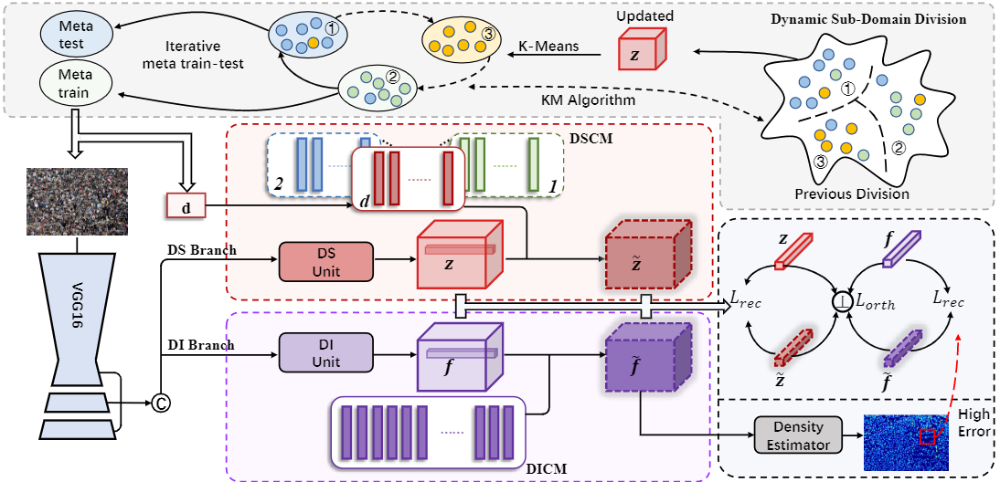

# Domain-general Crowd Counting in Unseen Scenarios

Official PyTorch implementation of 'Domain-general Crowd Counting in Unseen Scenarios'.(AAAI 2023 Oral) [[arXiv](https://arxiv.org/abs/2212.02573)]



## Evaluation

- Download our trained model, [SHA](https://drive.google.com/file/d/1WalB-jPXDvhpaiuvD8bQr4O9Olb2cWSD/view?usp=sharing) or [SHB](https://drive.google.com/file/d/1DwFy16sLq4F0qFsjP_sH-febjSgtTn2h/view?usp=sharing).

- Modify the path to the dataset and model for evaluation in 'test.py'.

- Run 'test.py'

## Acknowledgement

Part of codes are borrowed from [DomainBed](https://github.com/facebookresearch/DomainBed) and [dg_mmld](https://github.com/mil-tokyo/dg_mmld). Thanks for their great work!

## Citation

If you find this work useful, please cite

``` @article{du2022redesigning,
@article{du2022domain,
  title={Domain-general Crowd Counting in Unseen Scenarios},
  author={Du, Zhipeng and Deng, Jiankang and Shi, Miaojing},
  journal={arXiv preprint arXiv:2212.02573},
  year={2022}
}
